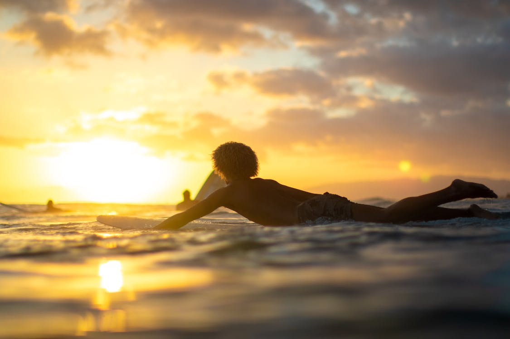
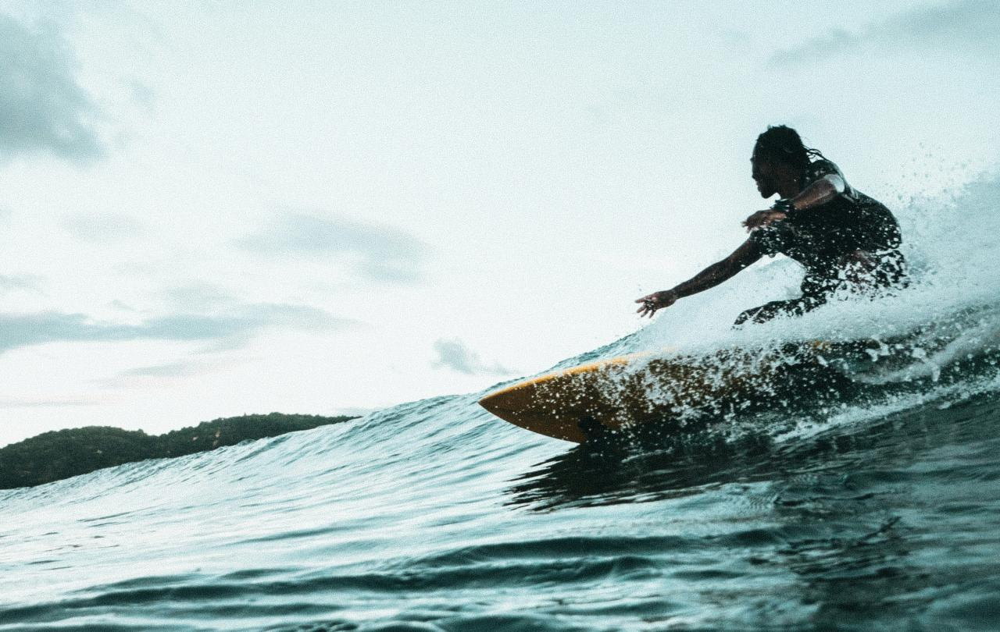
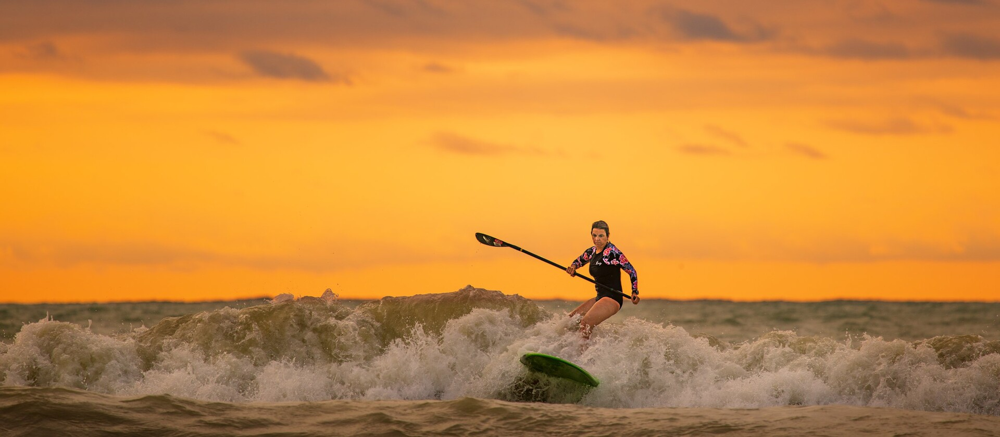

Sorena, clad in a new, thicker wetsuit for colder conditions, ventured out to Vejers Strand. Despite the promising weather forecast, the waves were absolutely not good to surfing. It was very challenging for Sorena, as the waves were overpowering and collapsing in rapid succession. Nonetheless, Sorena was eager to test the performance and warmth of the new wetsuit in the bracing North Sea waters.

The sun peeked through the clouds, casting a soft, diffused light on the scene, making the wet sand sparkle with countless tiny diamonds of light. Sorena adjusted the hood of the wetsuit, the neoprene a snug fit, and surveyed the choppy grey water. The powerful, albeit unrideable, waves crashed onto the shore, sending spray high into the air. It was clear that today was more about braving the elements and testing the gear than about catching perfect waves.

<figure>
  
  <figcaption>Looking for new opportunities—enthusiastic and full of expectations. But also lingering doubts about whether the waves are not too overwhelming.</figcaption>
</figure>

and some text after the image
